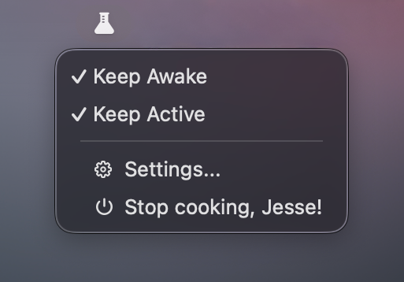
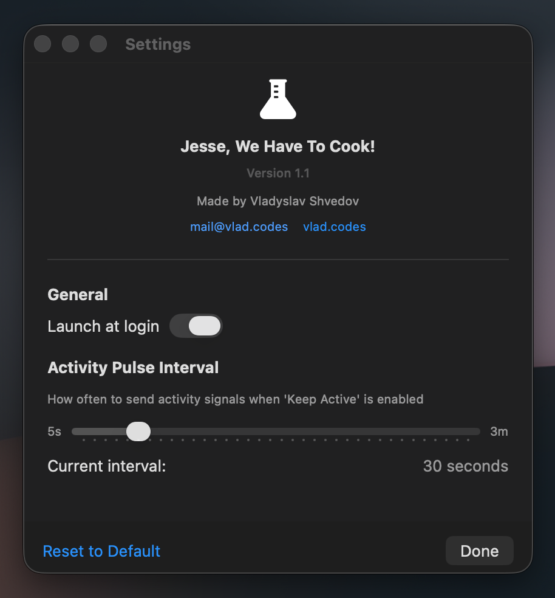

# Jesse, We Have to Cook!

Lightweight and modern macOS app that keeps your Mac awake and makes screensaver/activity control easily accessible.

## Why?

1. Easily accessible control over activity and screensaver
2. Small memory and storage footprint
3. Modern look and minimalistic K.I.S.S. ideology

## Screenshots

### Menu Bar Interface

### Settings Window

## Download & Install

### Option 1: Download Pre-built App
Check the [Releases](https://github.com/vshvedov/JesseWeHaveToCook/releases) page for the latest version.

**First time opening:**
1. Unpack and copy to "Applications"
2. Right-click the app and select "Open"
3. Click "Open" when macOS warns about an unidentified developer

As this is a self-signed macOS app, you may need to allow it from the Privacy Settings. Alternatively, you can build the app from the sources yourself.

## System Requirements

- macOS 15.6 or later
- About 10 MB of disk space
- Minimal CPU and memory usage (around 20MB of RAM)

## Privacy & Security

Privacy is the main idea behind Jesse, We Have to Cook. You never know what Jiggler or Amphetamine is sending back home. With an open source app you always have control and freedom of security and privacy reviews.

- No data collection
- No network requests
- No file system access beyond preferences
- Fully sandboxed for your security
- [View source code](https://github.com/vshvedov/JesseWeHaveToCook)

## Support

Having issues? Found a bug?
- [Open an issue](https://github.com/vshvedov/JesseWeHaveToCook/issues)
- Email: mail@vlad.codes

## Author

Made with 🍵 by [Vladyslav Shvedov](https://vlad.codes)

## License

MIT License - feel free to modify and share!
