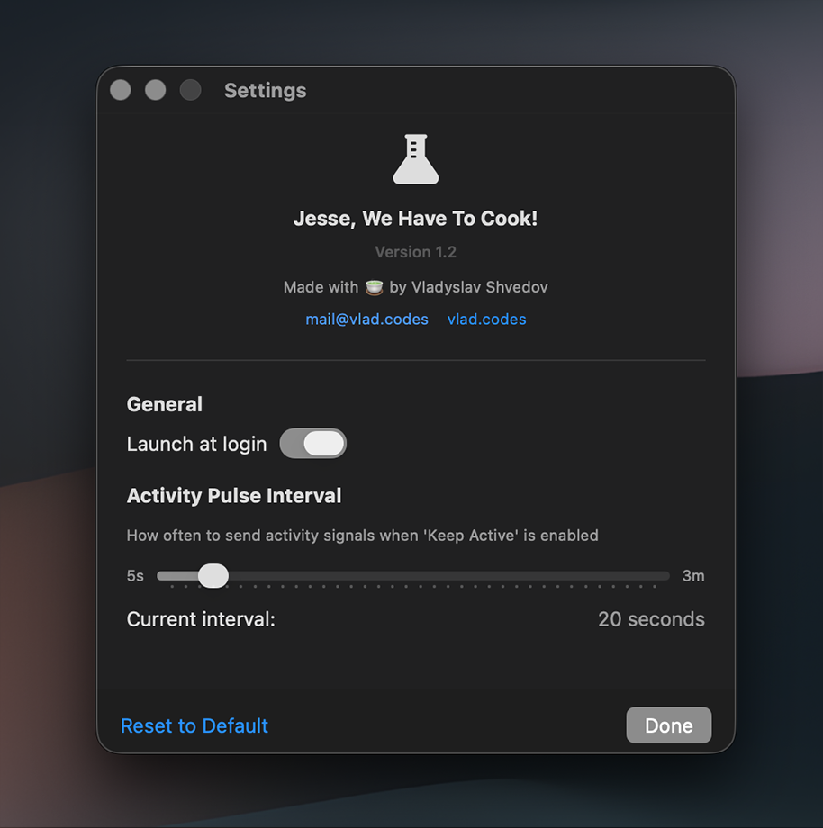

# Jesse, We Have to Cook!

Lightweight and modern macOS app that keeps your Mac awake and makes screensaver/activity control easily accessible.

## Why?

1. Easily accessible control over activity and screensaver in macOS
2. Open source
3. No tracking, no network activity, no ads, free forever
4. Small memory, CPU and storage footprint
5. Modern look and minimalistic K.I.S.S. ideology

## Screenshots

<div align="center">

### Menu Bar Interface


### Settings Window


</div>

## Download & Install

Check the [Releases](https://github.com/vshvedov/JesseWeHaveToCook/releases) page for the latest version.

**First time opening:**
1. Unpack and copy to "Applications"
2. Right-click the app and select "Open"
3. Click "Open" when macOS warns about an unidentified developer

```
As this is a self-signed macOS app, you may need to 
manually allow it from the Privacy Settings. 
Alternatively, you can build the app from the sources yourself.
```

## System Requirements

- macOS 15.6 or later
- About 10 MB of disk space
- Minimal CPU and memory usage (around 20MB of RAM)

## Privacy & Security

Privacy is the main idea behind Jesse, We Have to Cook. You never know what Jiggler or Amphetamine is sending back home. With an open source app you always have control and freedom of security and privacy reviews.

- No data collection
- No network requests
- No file system access beyond preferences
- Fully sandboxed for your security
- [View source code](https://github.com/vshvedov/JesseWeHaveToCook)

## Support

Having issues? Found a bug?
- [Open an issue](https://github.com/vshvedov/JesseWeHaveToCook/issues)
- Email: mail@vlad.codes

## Author

Made with 🍵 by [Vladyslav Shvedov](https://vlad.codes)

## License

The app comes with a simple, no-nonsense license you can read in one breath. In short: you’re free to use the code, tweak it, and run the app—just not for commercial gain. Keep it free, keep it good.

Jesse, We Have to Cook! License

Copyright © 2025 Vladyslav Shvedov

Permission is granted to any person to use, copy, modify, and share this software and its source code for non-commercial purposes only, provided that the following conditions are met:
	1.	Attribution: The name of the original author (Vladyslav Shvedov) must always remain visible in the source code and documentation.
	2.	No Removal or Renaming: The name of the author, contributors, and the name of the program (“Jesse, We Have to Cook!”) may not be removed, replaced, or changed.
	3.	Non-Commercial Use: This software and any modifications of it may not be sold, licensed for a fee, or used in any commercial product or service.
	4.	Freedom to Share: You may redistribute modified or unmodified versions freely, provided these same license terms are included.

This software is provided “as is,” without warranty of any kind.
